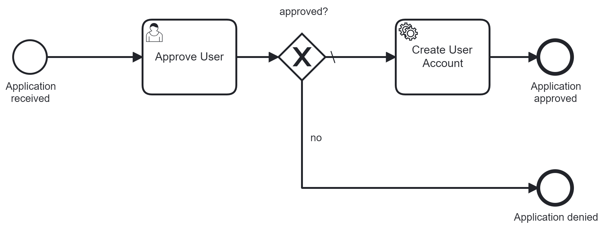




# Showcase for Camunda Platform 8 using the Bootstrap Accelerator for the C# Zeebe client

Camunda 8 .NET Showcase - Accelerated C# process automation development

This repository contains a showcase for **Camunda Platform 8** using .NET 7.0, the Bootstrap Accelerator for the C# Zeebe client
and a [docker-compose.yaml](docker-compose.yaml) file for local development.

## What it does

The showcase consists of a simple process including a User Task as well as a Service Task



The application includes a REST API for starting the process.

## Using the application

### Prerequisites

* .NET 7.0
* Docker
* A running Zeebe engine (see below for using docker-compose)

### Endpoints

The application serves the following endpoints:

| **Page**              | **URL**                                                                         |
|-----------------------|---------------------------------------------------------------------------------|
| Swagger UI            | [https://localhost:7065/swagger](https://localhost:7065/swagger/index.html)     |

### Using docker-compose

> :information_source: The docker-compose file in this repository uses the latest [compose specification](https://docs.docker.com/compose/compose-file/), which was introduced with docker-compose version 1.27.0+. Please make sure to use an up-to-date docker-compose version.

To stand-up a Camunda Platform 8 Self-Managed environment locally the [docker-compose.yaml](docker-compose.yaml) file in this repository can be used.

The development environment contains these components:
- Zeebe
- Operate
- Tasklist
- Elasticsearch

Issue the following command to start your environment:

```
docker-compose up -d
```

Wait a few minutes for the environment to start up and settle down.

Once everything has started you can navigate to the different web apps and log in with the user `demo` and password `demo`:
- Operate: [http://localhost:8081](http://localhost:8081)
- Tasklist: [http://localhost:8082](http://localhost:8082)
- Elasticsearch: [http://localhost:9200](http://localhost:9200)

The workflow engine Zeebe is available using gRPC at `localhost:26500`.

To tear down the whole environment run the following command

```
docker-compose down -v
```

In addition to the local environment setup with docker-compose, you should download the [Camunda Desktop Modeler](https://camunda.com/download/modeler/) to model BPMN diagrams for execution or open the showcases `process.bpmn` file.

## Show me the important parts

### Initialization & process deployment

In `Program.cs` you can find the initial setup of the Zeebe Client Accelerator:

```csharp
var builder = WebApplication.CreateBuilder(args);

// Bootstrap Zeebe Integration
builder.Services.BootstrapZeebe(
    builder.Configuration.GetSection("ZeebeConfiguration"),
    typeof(Program).Assembly);

...

var app = builder.Build();

...

// Deploy all process resources
app.CreateZeebeDeployment()
    .UsingDirectory("Resources")
    .AddResource("process.bpmn")
    .Deploy();

app.Run();
```

### Process start

The process is startet using the REST API and can be found in `ShowccaseController.cs`:

```csharp
    var variables = new ProcessVariables()
    {
        ApplicantName = applicationRequest.ApplicantName,
        BusinessKey = "A-" + DateTime.Today.DayOfYear + "." + new Random().Next(0, 9999)
    };

    _zeebeClient.NewCreateProcessInstanceCommand()
        .BpmnProcessId(ProcessConstants.PROCESS_DEFINITION_KEY)
        .LatestVersion()
        .Variables(_variablesSerializer.Serialize(variables))
        .Send();
```

### Service task implementation

The service task definition for "Create User Account" does not only define the required Task Definition Type, but also custom header information:


The corresponding worker code can be found in `AccountServiceWorker` and is quite simple:

```csharp
    [JobType("accountService")]
    [FetchVariables("applicantName")] // fetches only the variable 'applicantName' - not the 'businessKey'
    public class AccountServiceWorker : IAsyncZeebeWorker
    {
        private readonly ILogger<AccountServiceWorker> _logger;

        public AccountServiceWorker(ILogger<AccountServiceWorker> logger)
        {
            _logger = logger;
        }

        public Task HandleJob(ZeebeJob job, CancellationToken cancellationToken)
        {
            // get process variables
            ProcessVariables variables = job.getVariables<ProcessVariables>();
            // get custom headers
            AccountServiceHeaders headers = job.getCustomHeaders<AccountServiceHeaders>();

            // call the account service adapter
            _logger.LogInformation("Do {action} Account for {applicantName}", headers.Action, variables.ApplicantName);

            // done
            return Task.CompletedTask;
        }
    }

    class AccountServiceHeaders
    {
        public string Action { get; set; }
    }
```

## Links

* [Zeebe Workflow Engine](https://github.com/camunda/zeebe)
* [Zeebe C# client](https://github.com/camunda-community-hub/zeebe-client-csharp)
* [Bootstrap Accelerator for the C# Zeebe client](https://github.com/VonDerBeck/zeebe-client-csharp-accelerator)
* [Camunda 8 - Documentation](https://docs.camunda.io)
* [Camunda 8 - Getting Started Guide](https://github.com/camunda/camunda-platform-get-started)
